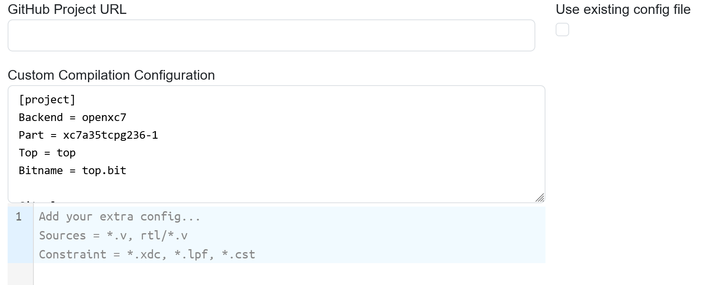

***FPGAOL Community Edition Compiling-as-a-Service (FPGAOL-CE CaaS) User Guide***

## Web Page Quick Start

Click on **"Template"** and select an example. 


> We have examples for various popular boards, including Digilent Xilinx boards, QMTech Kintex 7 board, Tang Nano 9K, Icebreaker and ULX3S. 

The code will be loaded to the "Constraint file" and "Verilog source file" editor section in less than a second. 

> If not, please check GitHub access, since the code is downloaded from GitHub. 

Press the blue **"Submit"** button below, and wait. The status line below will show `running` after submission, until `finished.succeeded` or `finished.failed` when the server finishes compilation. 

Then the **"Download Bitstream"** (if succeeded) and **"Fetch & Show Log"**/**"Download Log"** (no matter succeeded or failed) button will be clickable, and you can download bitstream/log. 

> It's recommended to just **"Fetch & Show Log"**. 

The bitstream can be loaded to development board by local tools like [openFPGAloader](https://github.com/trabucayre/openFPGALoader), or directly via our [WebUSB-based loader](./CaaS%20WebUSB%20User%20Guide.md). 


## Compilation Option Setup

There's four input fields on top of the web page: **Name**, **FPGA Part**, **Backend**, and **Top Module**. These will be specified automatically if you load a Template. 


- **Name**: the name of the project, doens't matter too much. Only affects the file name of downloaded bitstream/log. 
- **FPGA Part**: the FPGA you're using, ALL devices supported are listed in the selection! The default "Auto ()" entry means to use the device in the template. The device name will be filled in the bracket after a template is selected. 
 - Since all device names are listed, it's straightforward to change to a compatible footprint device and test compilation with the same code. 
- **Backend**: the toolchain used for compilation. Also defaulted to "Auto" and usually don't need to be changed. 

- **Top Module**: the top module name. Please don't forget to change this if you paste code from elsewhere, or are changing the top module name in code. Unlike IDEs, which may automatically pick a top name. 

If your board/chip is available in the templates, it's recommended to select a Template then copy/paste your code into the edit sections instead of manually specifying these fields. 

## Status line

<details>

The web page polls the backend server every few seconds during compilation. Good status is `running` when running, and `finished.succeeded` or `finished.failed`. If you see something like `undefined`, please check internet connection, maybe check internet requests in developer tools, and contact developer. 

Usually, log will be available even if compilation fails. If log is not available, usually it's missing input entries or backend's problem, please check code and constraint are not empty, or contact developer. 

</details>

## Reading the log

<details>
It's true that the log emitted by the open-source toolchains is harder to read, as they don't graphically list each warnings and errors. 

Usually, checking the last part of the log gives a clearest view of the error. **"Fetch & Show Log"** automatically scrolls to the bottom. 
For example, a missing `;` after `module ()` on line 6:

```
-- Parsing `top.v' using frontend ` -vlog2k' --

1. Executing Verilog-2005 frontend: top.v
top.v:8: ERROR: syntax error, unexpected TOK_LOCALPARAM, expecting ';'
```

- So please also check the line before the reported line with error. 

Timing and utilisation information can usually be found by searching keywords of "MHz" and "Utilisation" in the log, like in this ECP5 case: 

```
Info: Max frequency for clock 'CLK$SB_IO_IN_$glb_clk': 91.98 MHz (PASS at 12.00 MHz)
```

</details>

## GitHub URL compilation

The platform can also compile the source code directly from a GitHub directory URL. Select the **"GitHub"** on upper right corner, and the interface will be shown. 



> The compilation options is the same as ordinary project compilation. You can just select a template from ordinary mode, which will set all the options, then switch to URL compilation. 

> Example URLs: 
> - Use the default root directory of GitHub repo: https://github.com/FPGAOL-CE/FPGAOL-Caas-Tangnano9k-Test
> - Use a sub-directory and/or other branches: https://github.com/FPGAOL-CE/user-examples/tree/main/basys3

Just like any large project, the source files to use has to be specified. By default, ALL `*.v` files in the URL-pointed directory will be used as Verilog source, and files matching `*.cst, *.lpf, *.xdc` will be used as constraint file. 

If this cannot satisfy, usually because of: 

- Some source files are to be excluded (simulation file, etc.)
- Files are in subdirectory
- Verilog headers (.vh) are used *TODO: this is not yet well-supported by CaaS!* 

There's two ways for a more complex configuration. 

- Specify some extra config in the `Add your extra config...` colume. 
  - For example, `Sources = top.v, blinky.v, rtl/*.v`
- Use the config file from GitHub URL. Tick the **"Use existing conf file"**. 
  - Many demo projects have prepared this file. 
  - If using this option, this file is responsible for ALL compiling configurations, and the ones set on the web page will be ignored. 
    - Thus, you can use this function directly without setting up web page options. This is very convenient. 
  - One example of the config file is [TetriSaraj](https://github.com/FPGAOL-CE/openXC7-TetriSaraj/blob/caas/caas.conf). 

For both ways, please refer to [CaaS Wizard API Access](./CaaS%20Wizard%20API%20Access.md) for detailed configuration documentation and working principles. 


## Caution points

- When selecting a template, existing setups and codes will be cleared. 
  - You can use Ctrl-Z to undo the change. 


- The default top module name is `top`. Each template may specify their own top module name. 
