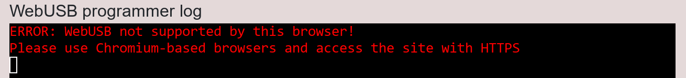
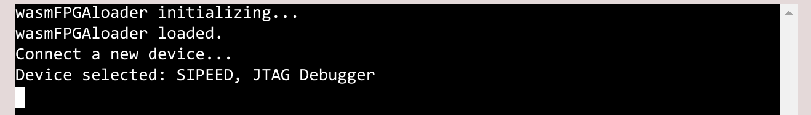
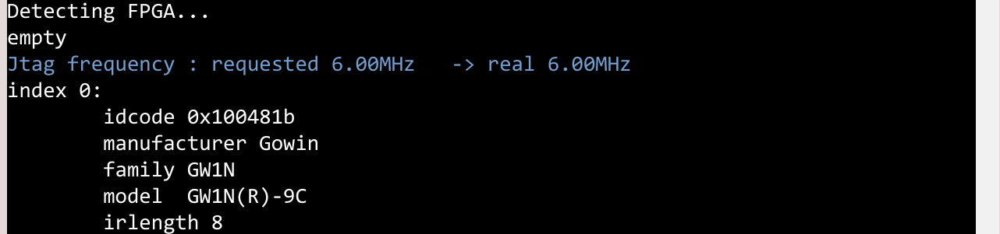
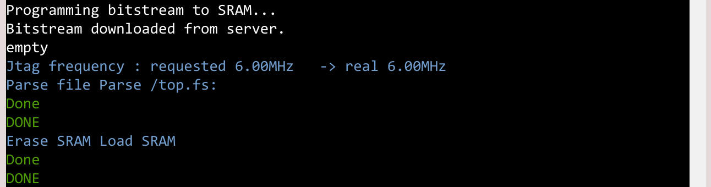

***FPGAOL-CE CaaS WebUSB User Guide***

Loading FPGA program directly via web browser. 

### Driver & Browser Preparation

Please see [WebUSB Drivers FTDI](./WebUSB%20Drivers%20FTDI.md) for driver setup, especially for Windows machines. For now, only FTDI-based setup is documented. 

WebUSB only works for chromium-based browsers like Google Chrome, Brave, etc., and only via HTTPS connection, please use a compatible browser. This prompt will be shown if the browser's not supported: 

When opening the web page for the first time, it may freeze a few seconds when the WASM module is being loaded. 

### Guide

1. After seeing `wasmFPGAloader loaded.` in WebUSB programmer log, the loader is ready to operate. Click **"Connect Local USB"**, a selection window from browser will pop up, please select your board/downloader. The browser can remember the device after refreshing the page. 

> Usually, it's shown as "JTAG Debugger", "Digilent", etc.

2. As a confirmation, the **"Detect FPGA"** will run the `openFPGAloader --detect` command, and show FPGA devices connected. 

> You can change the "JTAG Cable Type" option below if you know what cable is in use. Auto mode is enough most of the time though. 

3. The **"Program Bitstream..."** button fires the downloading. It's only usable when (1) a local USB device has been connected, and (2) a bitstream has been generated. 

> If the "Program to Flash" option is ticked, the bitstream will be programmed to persistent flash memory.

> Since the bitstream is fetched from the server first, it may take some time. 

### Caution points

- The platform is not recommended to have multiple USB devices selected together. 
  - Thus, if other devices (Keyboard, Mice, etc) are accidentally selected, the correct downloader may not be used. In this case, press the **"Disconnect all USB"** button, refresh the page, and **"Connect Local USB"** again. 
- The flash chip (NOT the FPGA chip itself) may have limited lifetime. Usually, I'll avoid program to flash too often. 
- If your custom device cannot be detected, please have a try using openFPGAloader on the local machine: if it still doesn't show up, probably the hardware setup is having some problem.
- For beginners, please note that the difference between an *"FPGA"* (the chip that runs the hardware logic) and a *"downloader"* (another external chip, like FT2232H, that loads data into the FPGA chip, usually with USB connection). 
  - On some boards, the "downloader" is integrated onto the development board, so a single USB cable handles both power and downloader (and maybe UART as well), like most Digilent boards, Tang Nano boards, etc. 
  - On others, the "downloader" is a dongle connected to the FPGA board via ribbon cables, additionally purchased, like for many Altera boards and QMTech boards. It can even be a RP2040 simulating the XVC protocol. The WebUSB loader (and any downloading software) uses the downloader. 
