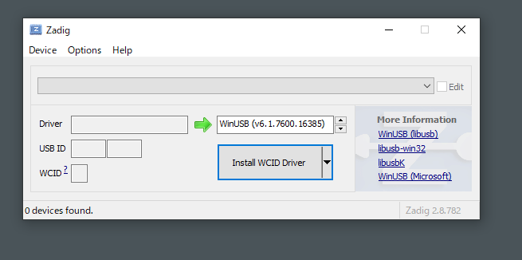
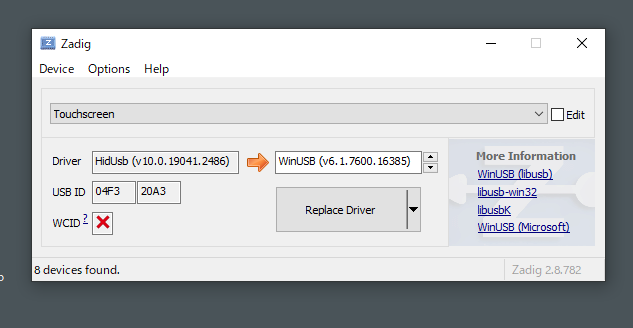
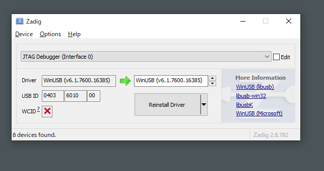

#### To Use FTDI Devices in Browser

**Windows**

- The default FTDI driver need to be replaced by WinUSB drivers for WebUSB access

- Download and install [Zidag](https://zadig.akeo.ie/) software. 

- It'll look at this by default: 

  

- Please select Options - List All Devices. Some device will be shown. 

  

- In the upper dropdown menu, select your FPGA Downloader device. It'll be named `JTAG Debugger` for Tang Nano 9K, for example. 

  

- Then click the Install Driver/Replace Driver button, and wait for a moment. 

  - In the previous picture, the button shows Reinstall Driver since the driver's already been installed. 

**Linux**

- Since Linux various by each distribution, maybe it works by default. 
- If there's error -5 when performing Detect FPGA on the webpage, please try `sudo modprobe ftdi_sio` to remove the kernel driver module. 
  - Note that the driver will be auto-reloaded when new FTDI USB device is plugged in. Write `blacklist ftdi_sio` in `/etc/modprobe.d/ftdi.conf` can be one solution. 

**Mac OS**

- Seems to work out-of-the-box. 
