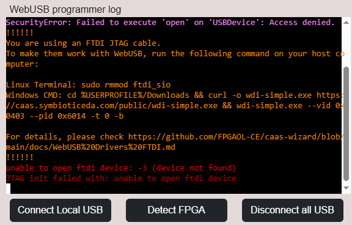
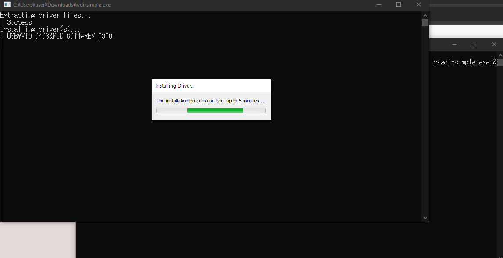
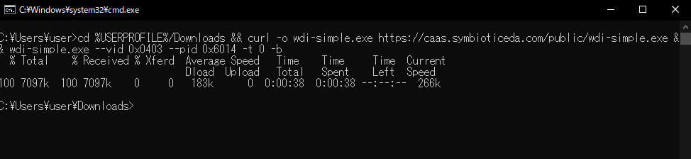

#### To Use FTDI Devices in Browser

##### Quick setup

Please just follow the instructions printed when warning messages like this is shown:

**Linux**

`sudo rmmod ftdi_sio`

**Windows**

1. Open a cmd.exe window. You can just press Windows key + R, input "cmd", then press enter. 

2. Copy and paste the command shown in the warning message. Click "Yes" when prompt window pops up. 

   The following output is expected:

   During installation (another cmd pops out)

   

   After installation

   

3. Try Detect FPGA or Program Bitstream again. Also try re-connect the board and refresh the caas webpage. 

---

##### How do I reverse the change?

**Linux**

When re-plugging in the USB device, ftdi_sio will be reloaded again. If not, run `sudo modprobe ftdi_sio`

**Windows**

- Go to Device Manager (can be opened with Windows key + R, input "devmgmt.msc", then press enter). 
- Find the USB device, like "Digilent USB Device". 
- Double click the device, go to the Driver tab, and Uninstall Driver. 
- If prompted for reason, choose a random one and confirm. 

---

##### The detailed, more complex way

**Windows**

- The default FTDI driver need to be replaced by WinUSB drivers for WebUSB access

- Download and install [Zidag](https://zadig.akeo.ie/) software. 

- It'll look at this by default: 

  

- Please select Options - List All Devices. Some device will be shown. 

  

- In the upper dropdown menu, select your FPGA Downloader device. It'll be named `JTAG Debugger` for Tang Nano 9K, for example. 

  

- Then click the Install Driver/Replace Driver button, and wait for a moment. 

  - In the previous picture, the button shows Reinstall Driver since the driver's already been installed. 

**Linux**

- Since Linux various by each distribution, maybe it works by default. 
- If there's error -5 when performing Detect FPGA on the webpage, please try `sudo modprobe ftdi_sio` to remove the kernel driver module. 
  - Note that the driver will be auto-reloaded when new FTDI USB device is plugged in. Write `blacklist ftdi_sio` in `/etc/modprobe.d/ftdi.conf` can be one solution. 

**Mac OS**

- Works out-of-the-box. 

#### Other information:
https://github.com/pbatard/libwdi/wiki/Zadig

wdi-simple.exe download: https://github.com/pbatard/libwdi/actions/workflows/vs2022.yml

https://github.com/Shaped/webusb-ftdi/

https://github.com/trabucayre/openFPGALoader/issues/245
